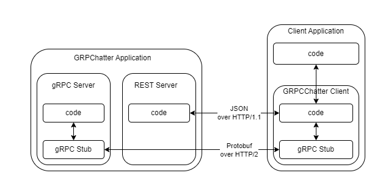
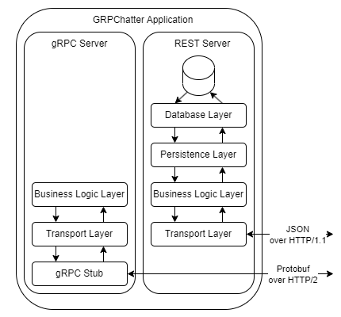
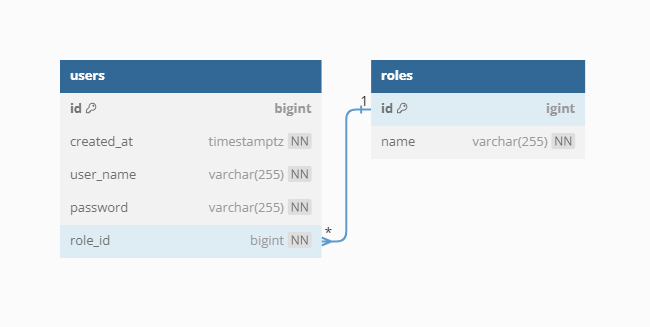

# GRPCChatter - Real-time Chat Application with gRPC

GRPCChatter is a real-time chat application built in Go, harnessing the power of gRPC for lightning-fast communication between clients. In addition, it offers a RESTful API for user account creation and authorization.

## Technologies

- Go 1.21
- gRPC
- PostgreSQL

## Key Dependencies

- **mux** (<https://pkg.go.dev/github.com/gorilla/mux>): Facilitates the creation of API servers and helps manage routing and HTTP request handling.
- **pqx** (<https://pkg.go.dev/github.com/lib/pq>) Simplifies interaction with PostgreSQL databases, making it easier to work with data storage and retrieval.
- **jwt** (<https://pkg.go.dev/github.com/golang-jwt/jwt>): Simplifies JWT token management, which is essential for authentication and authorization.
- **viper** (<https://pkg.go.dev/github.com/spf13/viper>): Efficiently manages configurations, allowing to configure and customize the application easily.
- **testify** (<https://pkg.go.dev/github.com/stretchr/testify>): Enhances testing capabilities by providing helpful utilities and assertions to streamline the testing processes.
- **crypto** (<https://pkg.go.dev/golang.org/x/crypto>): Used for secure password hashing, ensuring the protection of user credentials.
- **uuid** (<https://pkg.go.dev/github.com/google/uuid>): Used to generate universally unique identifiers, which can be valuable for aspects such as data integrity and tracking.

## Architecture Overview

GRPCChatter employs a robust client-server architecture using the gRPC server for chat-related stuff and REST Server for user authentication and authorization. Clients creates accounts and logs in using REST Server and using chat-related stuff via gRPC.



The architecture of the GRPCChatter is designed with a layered approach to ensure a clear separation of responsibilities and promote modularity. The system comprises the following core components:



- **Transport Layer**: Serves as the initial point of contact for incoming requests. It manages incoming HTTP & RPC requests, handling request authorization and validation before forwarding them to subsequent layer. Its primary responsibilities include request reception and input validation. Processed input is then passed to the Business Logic Layer for further handling. Once handling is complete and the Business Logic Layer returns a result, the Transport Layer interprets it and sends a proper response. The implementation is located in the [**server**](./internal/server) package.

- **Business Logic Layer**: Responsible for processing input received from the Transport Layer, the Business Logic Layer embodies the fundamental business rules and logic governing the application's functionality. Furthermore, it manages tokens, short codes, rooms, and users. The implementation is located in the [**service**](./internal/service) package.

- **Persistence Layer**: Responsible for managing the interaction between the application's business logic and the underlying database system. It acts as an intermediary, ensuring that data is stored, retrieved, and manipulated in a structured and efficient manner. The implementation is located in the [**repository**](./internal/repository) package.

- **Database Layer**: Specifically designed to interact with the underlying database system, which in this case is PostgreSQL. It abstracts the database operations, allowing the application to work with the database without needing to know the intricacies of SQL queries and database connections. The implementation is located in the [**database**](./internal/database) package.

## Database schema



The database revolves around the **users** table, storing essential user account information.

## Features

- **Authentication and Authorization**: GRPCChatter implements user authentication through usernames and passwords via the REST Server. It generates JWT tokens, ensuring that only authenticated users can access the gRPC Server, maintaining a secure environment.

- **Real-Time Communication**: Ensures instantaneous message delivery, establishing true real-time communication among clients.

- **Efficient Protocol**: By leveraging the gRPC framework, the application benefits from the efficiency and high-performance of the protobuf communication protocol.

- **User-Friendly**: The provided client code offers an intuitive and user-friendly interface, simplifying the process of initiating conversations and exchanging messages.

## Requirements

Before you can get started with this project, please ensure that you have the following prerequisites in place:

- **Go 1.21 or Compatible Version**: You'll need to have Go programming language installed on your system. If you haven't already installed it, you can download it from the official [**Go website**](https://go.dev/dl/).

- **Docker (Optional)**: If you prefer to run the application within a container, make sure you have Docker installed. You can download Docker from the official [**Docker website**](https://www.docker.com/get-started/).

These requirements will allow you to run the application either natively or in a Docker container.

## Getting Started

### Installation and Running the GRPCChatter

To start using GRPCChatter, follow these steps to run the application:

1. Clone the repository:

    ```
    git clone https://github.com/MSSkowron/GRPCChatter.git
    ```

2. Navigate to the project directory:

    ```
    cd GRPCChatter
    ```

3. Build & Run the application:

    ```
    go run ./cmd/grpcchatter/main.go
    ```

    Optionally, you can use the **--config** flag to specify a configuration file path. The provided configuration file should be in the **.env** format. If you don't provide any configuration, the [**default**](./configs/default_config.env) configuration will be used.

    You can configure the following values in your configuration file:
    - **DATABASE_URL**: Connection string for PostgreSQL database.
    - **REST_SERVER_ADDRESS**: IP address where the REST server will listen.
    - **REST_SERVER_PORT**: Port on which the REST server will listen.
    - **GRPC_SERVER_ADDRESS**: IP address where the gRPC server will listen.
    - **GRPC_SERVER_PORT**: Port on which the gRPC server will listen.
    - **TOKEN_DURATION**: Duration for which the JWT token is valid.
    - **SECRET**: Secret key used for JWT token signing and validation.
    - **SHORT_CODE_LENGTH**: Length of generated room short codes.
    - **MAX_MESSAGE_QUEUE_SIZE**: Maximum size of the message queue used to store messages to be sent to clients.

    Example of flag usage with a custom configuration file:

    ```
    go run ./cmd/grpcchatter/main.go --config "./configs/my_config.env"
    ```

4. Docker Support

    Alternatively, you can run the application using Docker. In the project directory, use the following command to start GRPCChatter within a Docker container:

    ```
    docker compose up
    ```

    The [**default**](./configs/default_config.env) configuration will be used.

### GRPCChatter REST Server

The REST Server serves is a component of the GRPCChatter application, responsible for managing user authentication and authorization, including user account creation and login. Below, we outline the supported endpoints of the server, along with their respective descriptions:

- **\/register Method: POST**: Registers a new user.

    Request body:

    ```json
    {
        "user_name": "string",
        "password": "string",
    }
    ```

    Response Body:

    ```json
    {
        "id": "int64",
        "created_at": "time.Time",
        "user_name": "string",
    }
    ```

- **\/login Method: POST**: Authenticates a user and returns an authentication token.

    Request Body:

    ```json
    {
        "user_name": "string",
        "password": "string"
    }
    ```

    Response Body:

    ```json
    {
        "token": "string"
    }
    ```

In case of errors, the server returns an appropriate status code and JSON in the following format:

```json
{
    "error": "string"
}
```

### GRPCChatter gRPC Server

The gRPC Server serves as the backbone of the GRPCChatter application, responsible for managing a range of gRPC methods. Below, you'll find a comprehensive list of the supported methods, each accompanied by its respective description:

- **CreateChatRoom**: This method empowers clients to create new chat rooms, complete with customized names and passwords. Upon successful creation, it issues a short access code, which users can later use with the JoinChatRoom method to enter the room. To utilize this feature, clients are required to include a gRPC header with the key `token`, containing a valid JSON Web Token (JWT) acquired from the login REST endpoint.

- **JoinChatRoom**: Clients can employ this method to join existing chat rooms by providing the room's short access code and the associated password. In order to access this method, clients must include a gRPC header with the key `token`, containing a valid JSON Web Token (JWT) acquired from the login REST endpoint. Upon successful authentication, this method returns a JWT necessary for facilitating communication within the room.

- **ListChatRoomUsers**: This method retrieves a list of users currently present in a chat room, based on the provided short access code. It proves invaluable for promptly listing all users currently online within a specific chat room. To use this feature, clients must attach a gRPC header labeled with the key `token`, containing a valid JSON Web Token (JWT) obtained through the JoinChatRoom method.

- **Chat**: Establishing a bidirectional streaming connection, this method enables real-time chat interactions between clients and the server. Clients can transmit messages to the server, and the server, in turn, responds with incoming messages. To utilize this feature, clients must include a gRPC header with the key `token`, containing a valid JSON Web Token (JWT) obtained from the JoinChatRoom method.

### GRPCChatter Client

The GRPCChatter Client is responsible for managing the client-side logic of the GRPCChatter application. It provides methods for creating chat rooms, joining chat rooms, sending messages, and receiving messages from the server. Client package is located [**here**](./pkg/client). Below are the methods supported by the client, along with their descriptions:

- **Register**: Allows users to create a client account by providing a username and password.

- **Login**: Enables the client's connection to the chat server.

- **CreateChatRoom**: Create a new chat room with a specified name and password. Upon successful creation, it returns the shortcode associated with the newly formed chat room. Prior to utilizing this feature, the Login method must be invoked to establish the client's identity.

- **JoinChatRoom**: This method connects the client to a designated chat room, enabling seamless message transmission and reception. If the client isn't already connected, it initiates the connection, joins the chat room, and establishes a bidirectional stream for real-time communication. The Login method must be executed before the initial usage.

- **ListChatRoomUsers**: Retrieve a list of users currently active within a chat room, based on the provided short access code. This method proves invaluable for promptly identifying all users currently online within a specific chat room. To utilize this functionality, the JoinChatRoom method should be invoked prior to use.

- **Send**: Send a message to the server. This method can either block until the message is successfully sent or return immediately in case of an error. To use this feature, it's essential to invoke the JoinChatRoom method before your first message transmission.

- **Receive**: Receive messages from the server. This method can either block until a new message arrives or return immediately in case of an error. As with other chat functions, the JoinChatRoom method must be called beforehand.

- **Disconnect**: Disconnect the client from the server, gracefully closing the connection between the client and server.

## Example

You can find an example client code in the [**client_cli**](./examples/client_cli/main.go) directory.
This demonstrates the usage of the client package through a CLI application.


## License

The project is available as open source under the terms of the MIT License.
