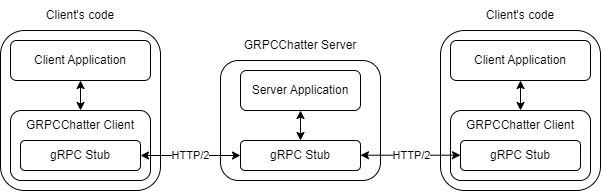
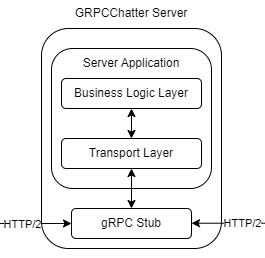
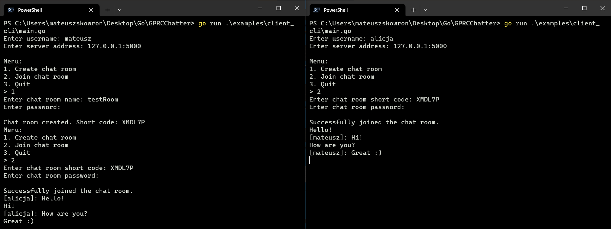

# GRPCChatter - Real-time Chat Application with gRPC

GRPCChatter is a real-time chat application implemented in Go, leveraging gRPC to facilitate seamless communication between clients. This application empowers users to connect and exchange messages in a responsive and uninterrupted manner.

## Technologies

- Go 1.21
- gRPC

## Key Dependencies

- **jwt** (<https://pkg.go.dev/github.com/golang-jwt/jwt>): Simplifies JWT token management.
- **viper** (<https://pkg.go.dev/github.com/spf13/viper>): Manages configurations efficiently.
- **testify** (<https://pkg.go.dev/github.com/stretchr/testify>): Enhances testing capabilities.
- **crypto** (<https://pkg.go.dev/github.com/MSSkowron/BookRESTAPI/pkg/crypto>): Utilized for bcrypt hashing.

## Architecture Overview

GRPCChatter employs a robust client-server architecture facilitated by the gRPC framework. Clients connect to the server via gRPC.



The architecture of the GRPCChatter Server is designed with a layered approach to ensure a clear separation of responsibilities and promote modularity. The system comprises the following core components:



- **Transport Layer**: Serves as the initial point of contact for incoming requests. It manages incoming RPC requests, handling request authorization and validation before forwarding them to subsequent layer. Its primary responsibilities include request reception and input validation. Processed input is then passed to the Business Logic Layer for further handling. Once handling is complete and the Business Logic Layer returns a result, the Transport Layer interprets it and sends a proper response. The implementation is [**here**](./internal/server).

- **Business Logic Layer**: Responsible for processing input received from the Transport Layer, the Business Logic Layer embodies the fundamental business rules and logic governing the application's functionality. Furthermore, it manages tokens, short codes, rooms, and client management. The implementation is located [**here**](./internal/services).

## Features

- **Real-Time Communication**: GRPCChatter ensures instantaneous message delivery, establishing true real-time communication among clients.

- **Efficient Protocol**: By leveraging the gRPC framework, the application benefits from the efficiency and high-performance of the protobuf communication protocol.

- **User-Friendly**: The provided client code offers an intuitive and user-friendly interface, simplifying the process of initiating conversations and exchanging messages.

## Requirements

Make sure you have Go 1.21 or a compatible version installed.

## Getting Started

### Installation and Running the GRPCChatter Server

To start using GRPCChatter, follow these steps to run the server:

1. Clone the repository:

    ```
    git clone https://github.com/MSSkowron/GRPCChatter.git
    ```

2. Navigate to the project directory:

    ```
    cd GRPCChatter
    ```

3. Build & Run the application's server:

    ```
    go run ./cmd/grpcchatter/main.go
    ```

    Optionally, you can use the **--config** flag to specify a configuration file path. The provided configuration file should be in the **.env** format. If you don't provide any configuration, the [**default**](./configs/default_config.env) configuration will be used.

    You can configure the following values in your configuration file:
    - **SERVER_ADDRESS**: The IP address where the server will listen.
    - **SERVER_PORT**: The port on which the server will listen.
    - **SECRET**: Secret key used for JWT token signing and validation.
    - **SHORT_CODE_LENGTH**: The length of generated room short codes.
    - **MAX_MESSAGE_QUEUE_SIZE**: The maximum size of the message queue used to store messages to be sent to clients.

    Example of flag usage with a custom configuration file:

    ```
    go run ./cmd/grpcchatter/main.go --config "./configs/my_config.env"
    ```

### GRPCChatter Server

The Server is the core component of the GRPCChatter application, responsible for handling various gRPC methods. Below are the methods supported by the server, along with their descriptions:

- **CreateChatRoom**: Allows clients to create a new chat room with custom name and password. Upon successful creation, it returns a short access code that users can employ to join the room later using JoinChatRoom method.

- **JoinChatRoom**: Allow clients to join existing chat rooms by providing the room's short access code and the associated password. After successful authentication, it returns a JSON Web Token (JWT) that contains two essential values in its payload: `userName` and `shortCode`. This JWT is crucial for facilitating communication within the room.

- **Chat**: Establishes a bidirectional streaming connection, enabling real-time chat between clients and the server. Clients can send messages to the server, and the server responds with incoming messages. To use this method, clients must attach a gRPC header with the key `token`, containing a valid JSON Web Token acquired from the JoinChatRoom method. This mechanism ensures continuous and secure communication within the chat room.

### GRPCChatter Client

The GRPCChatter Client is responsible for managing the client-side logic of the GRPCChatter application. It provides methods for creating chat rooms, joining chat rooms, sending messages, and receiving messages from the server. Client package is located [**here**](./pkg/client). Below are the methods supported by the client, along with their descriptions:

- **CreateChatRoom**: Creates a new chat room with the provided name and password. Upon successful creation, it returns the shortcode of the newly created chat room.

- **JoinChatRoom**: Connects the client to a specific chat room, enabling message reception and transmission. If the client is not connected, it establishes a connection, joins the chat room, and sets up a bidirectional stream for communication.

- **Send**: Sends a message to the server. It blocks until the message is sent or returns immediately if an error occurred. The JoinChatRoom method must be called before the first usage.

- **Receive**: Receives a message from the server. It blocks until a message arrives or returns immediately if an error occurred. The JoinChatRoom method must be called before the first usage.

- **Disconnect**: Disconnects the client from the server, closing the connection with the server.

## Example

An example client's code is provided [**here**](./examples/client_cli/main.go).
This example demonstrates the usage of the client package.



## License

The project is available as open source under the terms of the MIT License.
